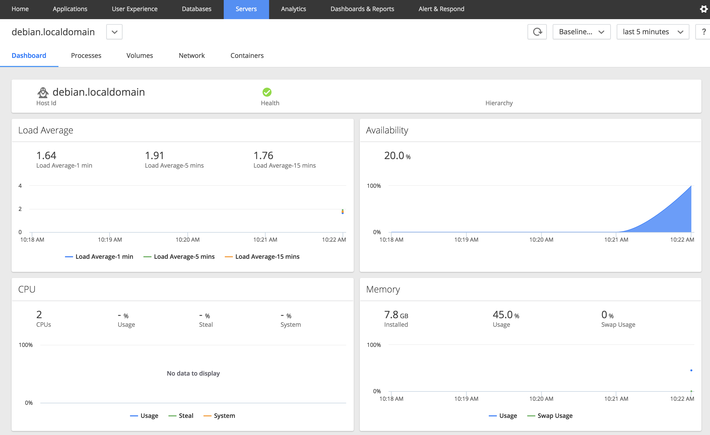
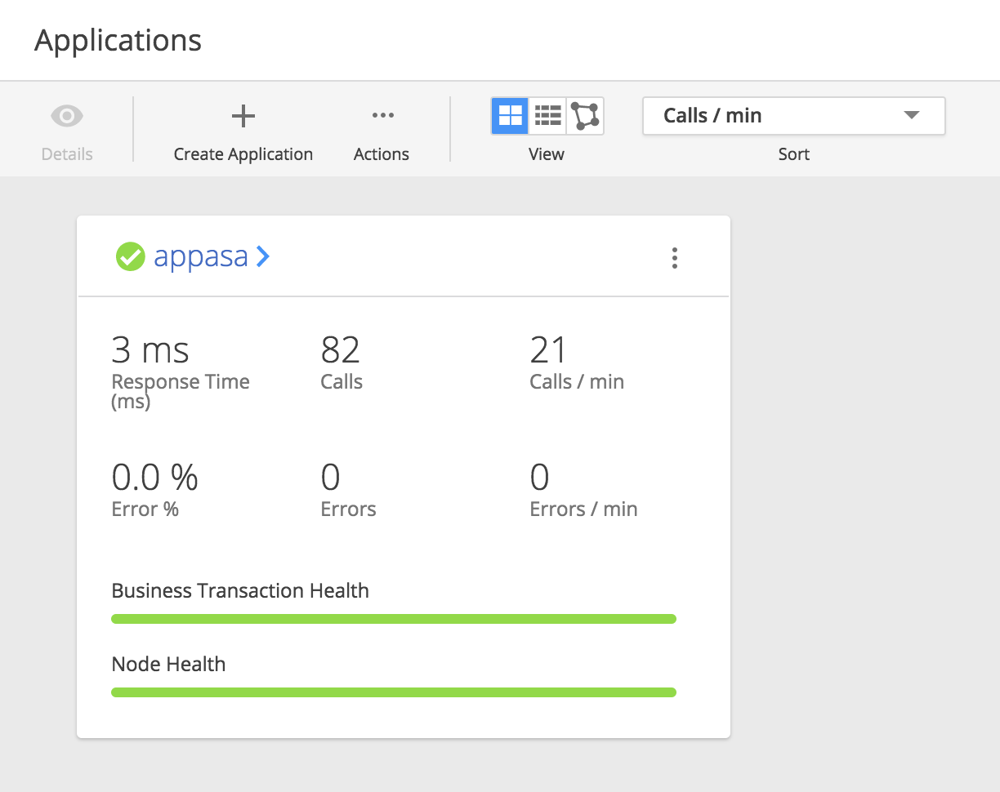
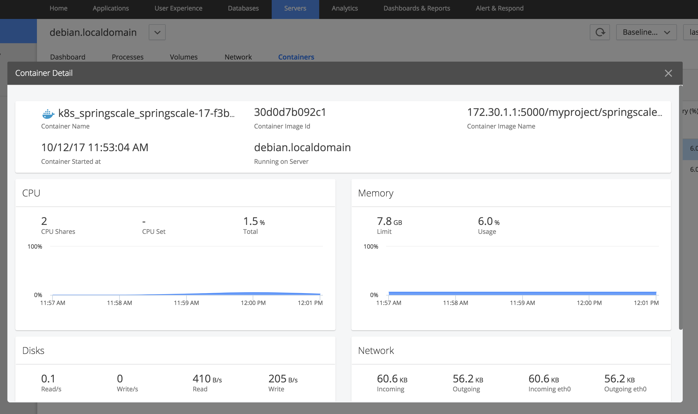
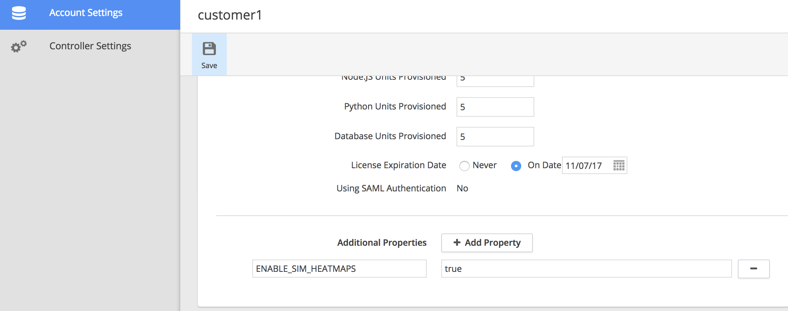
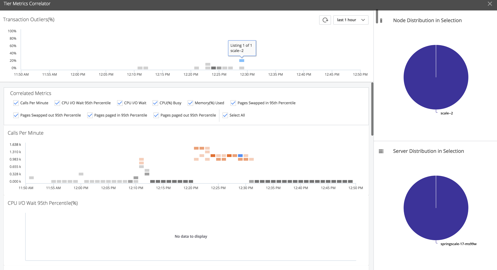
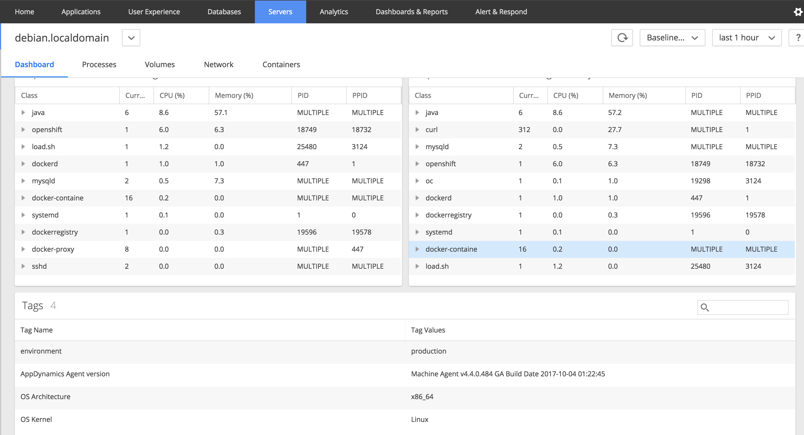

SE Lab for AppDynamics - Server Visibility
======
# 1. General Information
**This Lab will cover:**
* [Docker Visibility]
* [Server Tagging]
* [Tier Metric Correlator]

# 2. Lab Setup
## 2.1. Create your environment
* Log into [Ravello]
* Create an App from the Blueprint ```ServerVisibility-Lab-bp```
* SSH Credentials
  * User: ```ravello```
  * Password: ```Appdynamics123```
* Controller/Platform Credentials
  * User: ```admin```
  * Password: ```appdynamics```

## 2.2. Accessing the Lab
* SSH into your environment
  * ```ssh ravello@<YOUR RAVELLO IP>```
* Accessing the UIs
  * Platform Admin - ```http://<YOUR RAVELLO IP>:9191```
  * Controller - ```http://<YOUR RAVELLO IP>:8090```
  * OpenShift - ```https://<YOUR RAVELLO IP>:8443```

## 2.3. Setup Steps
* Start OpenShift
  * ```oc cluster up --public-hostname=<YOUR RAVELLO IP>```
* Login
  * ```oc login -u system:admin```
* Create Service Account (This is needed to do some privileged stuff in OpenShift)
  * ```oc create serviceaccount appd```
  * ```oc policy add-role-to-user view -z appd```
  * ```oc adm policy add-scc-to-user privileged -z appd```

# 3. Docker Visibility
## 3.1. Setup the Agent
* Check the [AppDynamics Agent] config file
* Properties required to activate Docker Visibility  

```
- name: APPDYNAMICS_SIM_ENABLED
  value: "true"
- name: APPDYNAMICS_DOCKER_ENABLED
  value: "true"
```
* Mount the Host Volumes and Docker Socket into the Agent containers

```
volumeMounts:
  - mountPath: /app-agent
    name: app-agent
  - mountPath: /var/run/docker.sock
    name: docker-sock
  - mountPath: /hostroot
    name: host-root
volumes:
- hostPath:
  path: /
name: host-root
- hostPath:
  path: /opt/app-agent
name: app-agent
- hostPath:
  path: /var/run/docker.sock
name: docker-sock
```
* Deploy the Agent
  * ```cd /home/ravello/openshift```
  * ```oc create -f appd-agents.yml```
* Check that the Agent shows up in your Controller UI Server tab
  * 

## 3.2. Deploy the Application
* Deploy the base Application
  * ```oc new-app codecentric/springboot-maven3-centos~https://github.com/michaelenglert/springscale```
* Patch the deployment so we can mount our host volume in
  * ```oc patch dc springscale -p '{"spec":{"template":{"spec":{"serviceAccountName":"appd"}}}}'```
* Add the Host Volume
  * ```oc volume dc/springscale --add -t hostPath -m /app-agent --path /opt/app-agent/```
* Set some environment variables
  * ROUTER_TCP_BALANCE_SCHEME - OpenShift Load Balancing setting to not use sticky session
  * APPDYNAMICS_AGENT_APPLICATION_NAME - Set AppDynamics App Name
  * APPDYNAMICS_AGENT_TIER_NAME - Set AppDynamics Tier Name
  * JAVA_OPTS - Actually adding the Agent and use Node Reuse
  * ```oc env dc/springscale ROUTER_TCP_BALANCE_SCHEME=roundrobin APPDYNAMICS_AGENT_APPLICATION_NAME=app APPDYNAMICS_AGENT_TIER_NAME=springscale JAVA_OPTS="-Dappdynamics.agent.reuse.nodeName.prefix=springscale -Dappdynamics.agent.reuse.nodeName=true -javaagent:/app-agent/javaagent.jar"```
* Check the Controller that our new App shows up
  * 
* Check that the Container is available as well
  * 

**Congratulations you successfully deployed Docker Visibility within OpenShift**

# 4. Tier Metric Correlator (Heatmaps)
## 4.1. Prepare the Application and Load
* Scale your Application
  * ```oc scale dc springscale --replicas=5```
* Get your service IP
  * ```oc status```
  * Look for ```svc/springscale - <Service IP>:8080```
* Put load on the system
  * ```/home/ravello/load.sh <Service IP>```
* Grab a coffee (10 minutes)

## 4.2. Enable Heatmaps
* Goto the admin.jsp of your Controller
* Login with Password ```appdynamics```
* Goto ```Account Settings```
* Edit Account ```customer1```
* Add additional property
  * ```ENABLE_SIM_HEATMAPS=true```
* Save



## 4.2. Use Heatmaps
* Login to the Controller
* Navigate to your ```Application``` --> ```Tiers & Nodes```
* Right Click the ```springscale``` Tier
* Click ```Correlate Metrics```
* Click on 1 of the outliers
* You will see the biggest outliers related to 1 specific Node


# 5. Server Tagging
* Get the POD list and note the exact name of the POD starting with ```appd-agents-```
  * ```oc get pods```
* Login to the POD
  * ```oc exec -ti <POD Name> /bin/bash```
* Navigate to the Server Monitoring config
  * ```cd /machine-agent/extensions/ServerMonitoring/conf/```
* Look at the file
  * ```more ServerMonitoring.yml```
* Add the dummy tag by uncommenting the lines
  * ```sed -i -e 's/^#tags/tags/g' ServerMonitoring.yml```
  * ```sed -i -e 's/^#    en/    en/g' ServerMonitoring.yml```
* Check the tag in the Controller UI


# 6. Troubleshooting
* Controller is not working
  * Restart the docker container ```docker restart appd-platform```
  * Start the services ```/home/ravello/startup.sh```
* Controller license expired
  * Get a license.lic file
  * Copy it to the ravello instance
    * ```scp /my/local/folder/license.lic ravello@<YOUR RAVELLO IP>/home/ravello/```
  * Copy it to the Controller
    * ```docker cp /home/ravello/license.lic appd-platform:/opt/appdynamics/platform/controller/```

# 7. Provide Feedback for the Lab

* Do a pull request
* Ping on [slack]

[AppDynamics Agent]: /openshift/appd-agents.yml
[Tier Metric Correlator]: https://docs.appdynamics.com/display/latest/Tier+Metric+Correlator
[Server Tagging]: https://docs.appdynamics.com/display/latest/Server+Tagging
[Docker Visibility]: https://docs.appdynamics.com/display/latest/Integrated+Docker+Visibility
[ravello]: https://cloud.ravellosystems.com/
[slack]: https://appdynamics.slack.com/messages/@michael.englert
